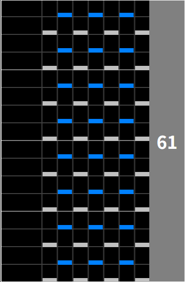
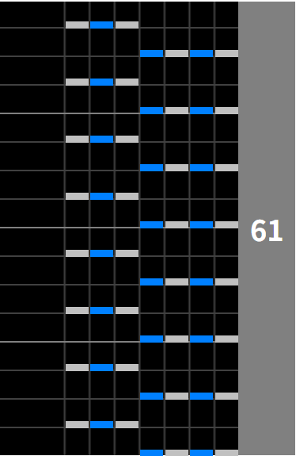

# RLT Manager

公開先: https://oyasume.github.io/iidx-rlt/

KONAMIの音楽ゲーム「beatmania IIDX」における、「ランダムレーンチケット」（譜面の配置を固定できるアイテム）の活用を支援するツールです。

<strong>ランダムレーンチケットとは</strong>

通常はRANDOMオプションを選択すると譜面の配置がランダムに変わりますが、チケットを消費することで、記載の配置に固定できる課金アイテムです。
要するに、スコア上げやクリアが楽になる、押しやすい配置を意図的に引けるアイテムです。

|           正規配置（1234567）            |  →  |         押しやすい配置（2461357）         |
| :--------------------------------------: | :-: | :---------------------------------------: |
|  |     |  |

※画像は<a href="https://textage.cc/" target="_blank" rel="noopener noreferrer">Textage.cc</a>様より引用

[IIDX公式ページの説明](https://p.eagate.573.jp/game/2dx/32/howto/lightning_model/random_lane.html)

主に以下の機能を提供します。

- 押しやすい配置になる曲の推薦: 所持チケットをどの曲に使えばいいかわからない人向け
- チケット検索: 大量のチケットを所持する人向けに、使いたいチケットを絞り込む機能
- Textageへのリンク: チケット使用時の譜面を確認するため、外部サイト [Textage](https://textage.cc/) 様を参照するリンク

## 背景

以下のような悩みをTwitterで見かけ、**一見価値のないチケットが実は有効活用できる**ことを知れるツールがあったら便利なのでは、と思って本ツールを開発しました。

- チケットをどの曲で使えばいいかわからない、使わずに期限切れになる
  - → 押しやすい配置の知識がないと使う気が起きない
- 大量に購入したのに当たりチケットが1つもなかった
  - → よく知られた配置（2461357）以外のチケットの使い道がわからない

本ツールは、いわゆる「当たり配置」になる曲を推薦することで、知識がなくてもチケットの使い道を見つけられるようにします。
なにが当たり配置なのかの定義は主観が入りますが、「譜面の難所が左右に分かれて簡単になる」を基準に、なるべく多くのプレイヤーに当てはまるようにしています。
曲ごとの当たり配置定義は、 [Google Spread Sheet](https://docs.google.com/spreadsheets/d/e/2PACX-1vTvdia8KZZiRbJ8WmaaFw64HixFWuuYP3HuxYzqfAYKvDso8ITI0OWITchKiv04T57uD2vk0bm9sMFx/pubhtml) で管理しています。

## 構成

- React, TypeScript, Vite
- Library: MUI, React Hook Form, Zod
- Lint/Format: ESLint, Prettier
- Test: Vitest, Testing Library
- CI/CD: GitHub Actions
- 収集: Google Analytics

beatmania IIDXはアーケードゲームなので、ゲームセンターでスマホで使うことをメインに想定して、以下をしています

- レスポンシブ対応
- PWA (Service Worker/Workbox)
  - ゲームセンターは通信環境の悪い地下にあることも多いので、オフラインで動くようにキャッシュ戦略を設定
